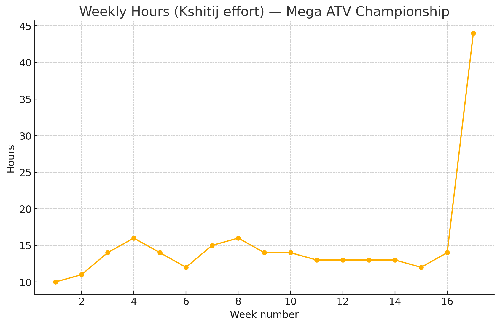
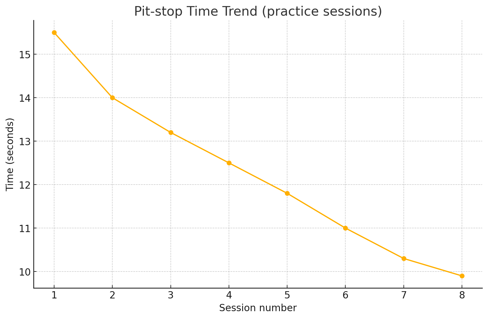

# Mega ATV Championship — Vice Captain (Systems Integration, Event Ops & Night‑Run Readiness)

**Timeline (hands‑on):** 21 Nov 2018 → 20 Mar 2019  
**Event week:** 18–20 Mar 2019 (Goa)  
**Role:** Vice Captain — cross‑subsystem coordination, event strategy, pit‑ops, logistics, and night‑run lighting readiness.  
**Team size:** ~30 (directly coordinated a cross‑functional core of ~12)

> This is a portfolio reconstruction. Original student work occurred in **2018–2019**; this repository was **reconstructed in Sept‑2025** from photos, the project report, and personal notes. No CAD is shared due to team IP.

## Vehicle — key specification (rule‑mandated engine package)
| Attribute | Value |
|---|---|
| Model | Briggs & Stratton Model 19 |
| Displacement | 305 cc |
| Engine | Single‑cylinder, 4‑stroke |
| Max power | 9 HP @ 3600 rpm |
| Max torque | ~17.5 Nm @ 3600 rpm |
| Fuel system | Carburettor |
| Fuel capacity | ~5 L |
| Starter | Rewind (handle at ~10:30 position) |

## Responsibilities & highlights
- **Night‑run capability:** specified and installed **auxiliary lighting**; carried out aiming tests to ensure visibility without glare.  
- **Sand‑track readiness:** tyre‑pressure tuning, traction strategy, and drivetrain alignment for sandy climbs.  
- **QA gates & pit‑ops:** pre‑run torque/fluids/chain/brake checks; 10‑second pit‑stop drills with role cards and kitted toolboxes.  
- **Scrutineering and fixes:** coached sub‑teams to close issues quickly (brake line routing, guards, harness checks).  
- **Logistics:** vehicle shipped as a kit; re‑assembly on arrival; spares and workshop liaison in Goa.

## Evidence
- Photos in [`/media/photos`](./media/photos). Some carry **Autosports India / Mega ATV Championship** watermarks — retained for credit.  
- Technical inspection sticker image included.  
- Project report: [`docs/Project_3_Mega_ATV_Championship_Report.docx`](./docs/Project_3_Mega_ATV_Championship_Report.docx).

## Time accounting
- **Phase A — Build, upgrades & event (21 Nov 2018 → 20 Mar 2019):** integration, sand‑track prep, lighting, testing, transport, event ops **≈ 240–300 hours**.  
  **Progress log:** [week‑by‑week](./docs/progress-log_2018-11-21_to_2019-03-20.md) · [weekly hours CSV](./docs/weekly_hours.csv) · [category split CSV](./docs/progress_hours_breakdown.csv).  
- **Phase B — Post‑event tidy‑up (late Mar 2019):** debrief, return logistics, short notes **~4–6 hours**.  
- **Phase C — Repo reconstruction (Sept‑2025):** README, structure, captions **~6–8 hours**.

## Operational KPIs (indicative, reconstructed)
- **Pit‑stop time (practice):** improved from ~15.5 s → **≤10 s**.  
- **QA pass rate (gate pre‑run):** ~70% → **~92%** before event week.  
- **Setup time on arrival:** kit‑to‑test in **<1 day** due to pre‑staged spares & run‑sheet.  
- See full notes: [`docs/kpis.md`](./docs/kpis.md) and charts below.




## File map
```
/docs           # report, logs, run-sheet, risk log, KPI notes, captions, changelog
/media/photos   # event & prep photos (with credits where applicable)
/media/evidence # inspection stickers, approvals, IDs (optional)
/media/charts   # charts generated from CSVs
```

## Integrity, credits & licensing
- **Reconstruction notice:** This repo documents learning and leadership; it is **not** a full design release.  
- **No CAD shared:** team IP.  
- **Image credits:** photos bearing **Autosports India / Mega ATV Championship** watermark are credited accordingly and included for educational/portfolio purposes.  
- **Structure & transparency pattern:** provenance + time accounting + progress log approach adapted from a template we use across student repos.

## Contact
**Kshitij Pandey** · <kshitijpandeybplgmail.com> · [LinkedIn](https://www.linkedin.com/in/kshitij-pandey20/)
